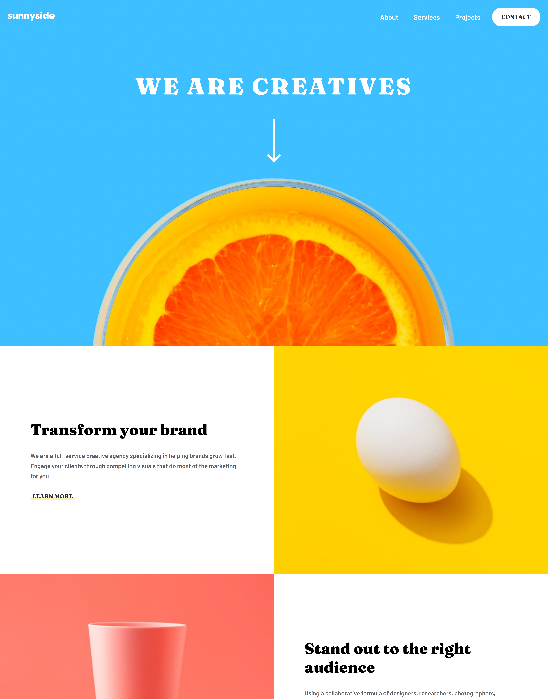

# Frontend Mentor - Sunnyside agency landing page solution

This is a solution to the [Sunnyside agency landing page challenge on Frontend Mentor](https://www.frontendmentor.io/challenges/sunnyside-agency-landing-page-7yVs3B6ef). Frontend Mentor challenges help you improve your coding skills by building realistic projects.

## Table of contents

- [Overview](#overview)
  - [The challenge](#the-challenge)
  - [Screenshot](#screenshot)
  - [Links](#links)
- [My process](#my-process)
  - [Built with](#built-with)
  - [What I learned](#what-i-learned)
- [Author](#author)

## Overview

### The challenge

Users should be able to:

- View the optimal layout for the site depending on their device's screen size
- See hover states for all interactive elements on the page

### Screenshot



### Links

- Solution URL: [Code URL](https://github.com/saakarx/sunnyside-agency-landing-page)
- Live Site URL: [Live Site URL](https://sunnyside-agency-landing-page-ashen.vercel.app/)

## My process

### Built with

- Semantic HTML5 markup
- CSS custom properties
- Flexbox
- CSS Grid
- Mobile-first workflow

### What I learned

Stacking Using Display Grid

Learned this from WesBos' CSSGrid Course

- For this you need to set `grid-template-columns` and `grid-template-rows` to `1`
- Then set the style for the tags you need by `grid-column: 1 / -1` and `grid-row: 1 / -1`

---

A look at how I used it in the styles

```css
.gc-1-1fr {
  display: grid;
  grid-template-columns: 1;
  grid-template-rows: 1;
}
.graphic-design__content,
.graphic-design__image {
  grid-column: 1 / -1;
  grid-row: 1 / -1;
}
```

## Author

- Frontend Mentor - [@saakarx](https://www.frontendmentor.io/profile/saakarx)
- Twitter - [@SaakarX](https://www.twitter.com/SaakarX)
